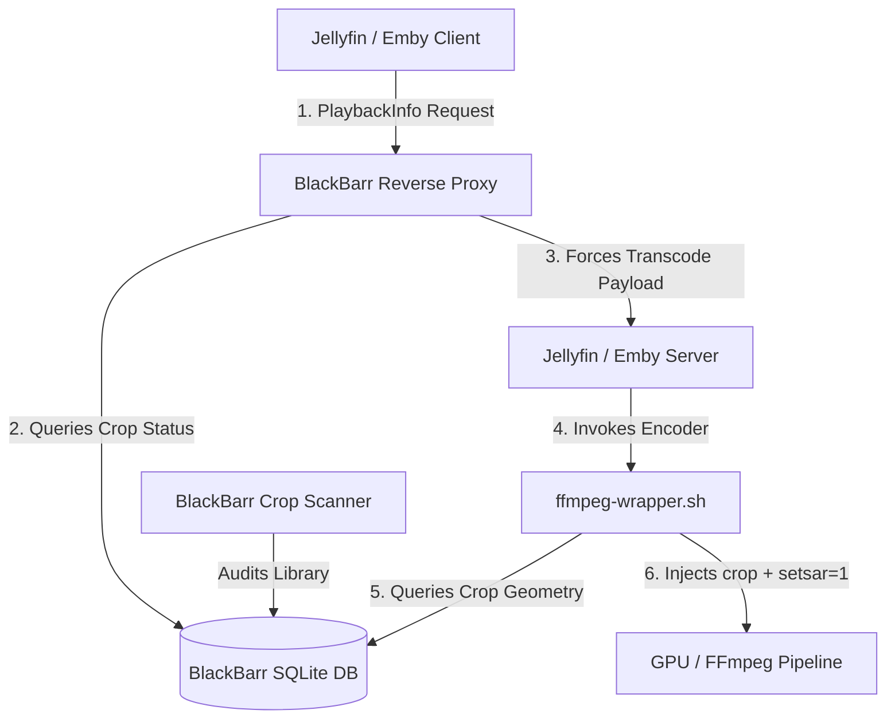

# BlackBarr ⬛🎥

[](https://github.com/EatPrilosec/BlackBarr)
[](LICENSE)
[](https://www.python.org/)

**BlackBarr** is an automated media pipeline middleware and proxy for **Jellyfin** and **Emby**. It automatically detects black bars (letterboxing/pillarboxing) in your video library and dynamically injects hardware-accelerated crop filters into playback streams on the fly — eliminating black bars so media plays in **full native aspect ratio** across all devices.

---

## ⚡ How It Works

BlackBarr operates using three core components working together seamlessly:



### 1. 🔍 Crop Scanner
- **Multi-Keyframe Sampling**: Audits video files by sampling keyframes across timestamps, calculating luma bounds for both SDR and 10-bit HDR / Dolby Vision content.
- **Symmetrical Centering**: Calculates even $y$-offsets to center cropped widescreen content perfectly.
- **Anamorphic Normalization**: Detects non-square pixel aspect ratios (`SAR != 1:1`) and injects `,setsar=1` square-pixel normalization.
- **IMAX / Multi-Aspect Ratio (MAR) Protection**: Performs frequency-cluster analysis across timestamps. Movies with dynamic scene switches (e.g. *Top Gun Maverick*, *Joker Folie à Deux*) are automatically flagged as **`MAR`** and left **100% untouched**.

### 2. 🔀 Smart Reverse Proxy
- Listens on dedicated reverse proxy ports for Jellyfin (`:6796`) and Emby (`:6797`).
- Intercepts `/PlaybackInfo` endpoints. If an item requires letterbox cropping, BlackBarr mutates the payload to enforce high-bitrate transcoding while preserving full source resolution (minus black bars.)
- All non-cropped media and standard traffic pass through untouched.

### 3. ⚙️ POSIX FFmpeg Wrapper
- A 100% POSIX `/bin/sh` wrapper script (`ffmpeg-wrapper.sh`) auto-injected into Jellyfin and Emby configuration directories.
- Intercepts server encoder invocations and injects dynamic `crop=W:H:X:Y,setsar=1` filters into `-vf` or `-filter_complex` graphs.
- **Hardware-Aware**: Supports **VAAPI** (AMD/Intel), **Intel QSV**, **NVIDIA NVENC**, and **CPU** software pipelines.

---

## 🐳 Docker Setup (Recommended)

Here is a production-ready `docker-compose.yml` deploying BlackBarr alongside Jellyfin, Emby, and VAAPI hardware acceleration.

```yaml
version: '3.8'

services:

  # -------------------------------------------------------------
  # BlackBarr Middleware
  # -------------------------------------------------------------
  blackbarr:
    image: ghcr.io/eatprilosec/blackbarr:latest
    container_name: blackbarr
    restart: unless-stopped
    devices:
      - /dev/dri:/dev/dri  # Required for GPU VAAPI crop detection
    ports:
      - "6795:6795" # Web Management UI & REST API
      - "6796:6796" # Dedicated Jellyfin Reverse Proxy
      - "6797:6797" # Dedicated Emby Reverse Proxy
    environment:
      - TARGET_SERVER_URL=http://jellyfin:8096
      - TARGET_EMBY_URL=http://emby:8096
      - PORT=6795
      - JELLYFIN_PORT=6796
      - EMBY_PORT=6797
      - SCAN_DIRECTORIES=/Storage/Media/Library/Movies, /Storage/Media/Library/Shows
      - TZ=America/New_York
    volumes:
      - /DockerData/blackbarr/config:/config
      - /DockerData/jellyfin/config:/target-jellyfin-config
      - /DockerData/emby/programdata:/target-emby-config
      - /Storage/Media/Library:/Storage/Media/Library:ro

  # -------------------------------------------------------------
  # Jellyfin Media Server
  # -------------------------------------------------------------
  jellyfin:
    image: jellyfin/jellyfin:latest
    container_name: jellyfin
    network_mode: host
    devices:
      - /dev/dri:/dev/dri
    environment:
      - JELLYFIN_FFMPEG=/config/ffmpeg-wrapper.sh
    volumes:
      - /DockerData/jellyfin/config:/config
      - /Storage/Media/Library:/Storage/Media/Library:ro
    depends_on:
      blackbarr:
        condition: service_healthy

  # -------------------------------------------------------------
  # Emby Media Server
  # -------------------------------------------------------------
  embyserver:
    image: emby/embyserver:latest
    container_name: embyserver
    network_mode: host
    devices:
      - /dev/dri:/dev/dri
    environment:
      - UID=1000
      - GID=1000
    volumes:
      - /DockerData/emby/programdata:/config
      - /DockerData/emby/programdata/00-emby-preinit.sh:/etc/cont-init.d/00-emby-preinit.sh
      - /Storage/Media/Library:/Storage/Media/Library:ro
    depends_on:
      blackbarr:
        condition: service_healthy
```


---

## 🏎️ Hardware Acceleration Setup

BlackBarr and its wrapper natively support GPU hardware acceleration:

### 1. AMD & Intel (VAAPI)
Pass GPU render nodes to your containers:
```yaml
devices:
  - /dev/dri:/dev/dri
```
BlackBarr automatically uses Mesa VAAPI drivers (`/dev/dri/renderD128`) for fast hardware crop detection and streams using `hwdownload,format=nv12,crop=...,setsar=1,hwupload`.

### 2. Intel QuickSync (QSV)
When QSV flags are detected in FFmpeg parameters, the wrapper automatically injects `vpp_qsv=crop_w=W:crop_h=H:crop_x=X:crop_y=Y,setsar=1`.

### 3. NVIDIA (NVENC/CUDA)
Ensure `nvidia-container-toolkit` is installed on your host and pass GPU resources via Docker Compose `deploy.resources.reservations.devices`. (untested, no nvidia gpu to test)

---

## 📖 Basic Usage Guide

### 0. Setup Confirmations
Ensure your jellyfin and emby compose elements have the depend lines, and the required env for jellyfin, and init script mount line for emby, so the ffmpeg wrapper can work.

Init and wrapper scripts:
- BlackBarr installs the wrapper script into your jellyfin and emby config dirs for you
- BlackBarr installs the init script into the emby server for you as well
- BlackBarr DOES NOT edit your compose file 

The proxy
- the proxy is not necessary for this to work, only transcoding. but direct play will not crop black bars.
- the proxy is only used to trick the server into transcoding files that have crop information, when they would normally directplay.
- if you want crops to automatically be applied, you must access emby and jellyin through the proxy, that just means you use the new ports, 6796 and 6797 (or whatever ports you setup in the blackbarr compose file,) to access jellyfin and emby now, you will need to point a reverse proxy to those ports now, instead of emby or jellyfins ports. 

### 1. Accessing the Web UI
Open your browser to:
`http://<your-server-ip>:6795/ui`

### 2. Scanning Your Library
- **Automatic Scan**: Runs automatically on container startup and periodically according to your configured interval.
- **Manual Scan**: Click **Scan Library** in the header to run a standard scan.
- **Deep Scan**: Click **Deep Scan** to trigger an extended 15-sample, 120-frame audit for tricky media files.

### 3. Status Badges & Filtering
- 🟢 **`PROCESSED`**: Black bars detected and crop parameters calculated (or verified full-frame with no crop needed).
- 🟣 **`MAR (IMAX)`**: Dynamic aspect ratio media detected. Left untouched as `NO CROP`.
- 🟡 **`PENDING`**: Queued for scanner evaluation.
- 🔴 **`ERROR`**: Unreadable or corrupt media stream.

### 4. Adjusting Parallel Scan Threads
Open **Settings** (gear icon) in the Web UI:
- Adjust **Parallel Threads** (Default: `2`, range `1` to `16`) to speed up background scanner audits across multi-core CPUs.

---

## 📄 License

Distributed under the MIT License. Built for seamless media pipeline optimization.
