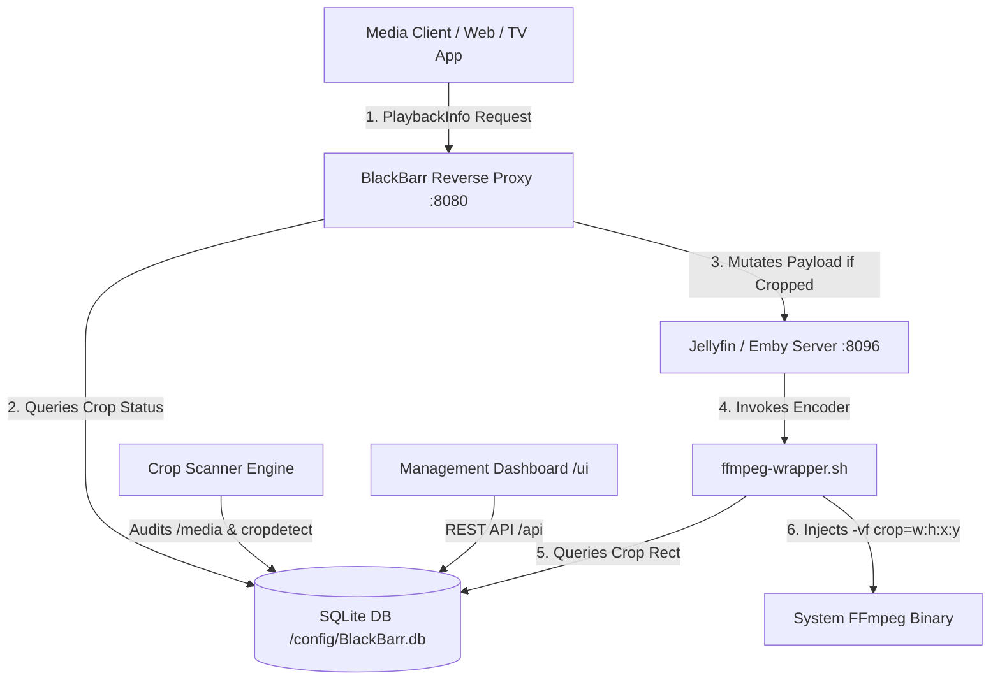

# BlackBarr ⬛🎥

**BlackBarr** is a lightweight media pipeline middleware for **Emby** and **Jellyfin**. It automatically detects black bars (letterboxing/pillarboxing) in media libraries using `ffprobe` and multi-keyframe `ffmpeg -vf cropdetect`, forces Emby/Jellyfin to transcode flagged media via a smart reverse proxy, and dynamically injects hardware-aware `crop` filters into the server's FFmpeg encoding pipeline on the fly.

---

## 🌟 Key Features

- ⚡ **Reverse Proxy (Transcode Enforcer)**: Intercepts Emby/Jellyfin `/PlaybackInfo` endpoints and mutates request/response parameters to force transcoding exclusively on items containing black bars. Pass-through for all other media traffic with zero overhead.
- 🔍 **Automated Crop Scanner**: Recursively audits mounted `/media` directories, probes SDR/HDR streams, and samples keyframes using `cropdetect` with color space limits (SDR limit `24`, 10-bit HDR limit `0.05`).
- 🚀 **Fast Hash Verification**: Uses `md5(path + size + mtime)` caching in SQLite (WAL mode). Re-scanning occurs only when files change on disk.
- 🛠️ **Hardware-Aware FFmpeg Wrapper**: Standalone bash script (`ffmpeg-wrapper.sh`) intercepting server encoder commands. Dynamically injects software `crop=w:h:x:y`, Intel QuickSync `vpp_qsv=crop_w=...`, or CUDA/NVENC crop filters into `-vf` / `-filter_complex`.
- ⚙️ **Auto-Configuration Injector**: Automatically updates `<EncoderAppPath>` / `<FfmpegPath>` in target Emby/Jellyfin `encoding.xml` or `system.xml` on container startup.
- 🎨 **Modern Management Web UI**: Glassmorphic dark-mode dashboard built with Tailwind CSS. Live status badges (`Cropped`, `No Black Bars`, `Pending`, `Error`), manual crop overrides, scanner triggers, and global configuration toggles.
- 🐳 **Multi-Arch Container**: Pre-built Docker images for `linux/amd64` and `linux/arm64`.

---

## 🏗️ Architecture Overview



---

## 🚀 Quick Start (Docker Compose)

Add `BlackBarr` to your `docker-compose.yml`:

```yaml
version: '3.8'

services:
  blackbarr:
    image: ghcr.io/your-user/blackbarr:latest
    container_name: blackbarr
    restart: unless-stopped
    ports:
      - "8080:8080"
    environment:
      - TARGET_SERVER_URL=http://jellyfin:8096
      - PORT=8080
      - MEDIA_DIR=/media
      - BLACKBARR_DB_PATH=/config/BlackBarr.db
    volumes:
      - ./blackbarr-config:/config
      - /path/to/media:/media:ro
      # Optional: Auto-inject wrapper into Jellyfin configuration
      - /path/to/jellyfin/config:/target-jellyfin-config:rw
    depends_on:
      - jellyfin

  jellyfin:
    image: jellyfin/jellyfin:latest
    container_name: jellyfin
    restart: unless-stopped
    ports:
      - "8096:8096"
    volumes:
      - /path/to/jellyfin/config:/config
      - /path/to/media:/media:ro
```

Run container:
```bash
docker compose up -d
```

Access the BlackBarr Management UI at: `http://localhost:8080/ui`

---

## 🔧 Environment Variables

| Variable | Default | Description |
| :--- | :--- | :--- |
| `TARGET_SERVER_URL` | `http://localhost:8096` | Downstream Jellyfin or Emby server URL |
| `PORT` | `8080` | Port for BlackBarr proxy & REST API |
| `MEDIA_DIR` | `/media` | Directory to audit for video files |
| `BLACKBARR_DB_PATH` | `/config/BlackBarr.db` | SQLite database file location |

---

## 📡 Management REST API

- `GET /api/media` - Searchable & paginated list of scanned media entries.
- `POST /api/scan` - Trigger manual library scan (`?force=true`).
- `GET /api/scan/status` - Live scanner progress and current file being audited.
- `PUT /api/media/{id}` - Override/edit crop value or status.
- `POST /api/media` - Manually create new crop entry.
- `DELETE /api/media/{id}` - Remove media entry from database.
- `GET /api/stats` - Total, cropped, full frame, pending, error counters.
- `GET /api/config` & `POST /api/config` - Get or update middleware configuration.

---

## 📄 License

MIT License. Built for seamless media pipeline optimization.
